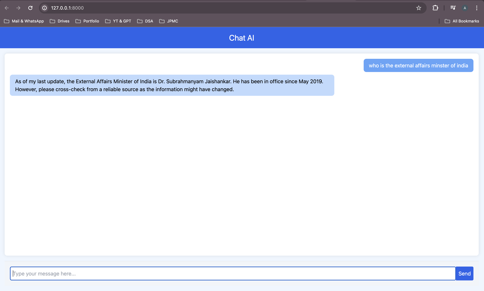

Sure, here is a README for your Django project:

---
# How it looks !! 



# ChatGPT Django Project

This is a simple Django project named `chatgpt` with an application called `chat` that integrates with OpenAI's API to generate responses. The application provides a web interface where users can input a prompt and receive a generated response displayed on the page.

## Features

- Simple web interface for interacting with the OpenAI API.
- Displays generated responses from the OpenAI API.
- Easy to set up and run locally.

## Requirements

- Python 3.8 or higher
- Django 3.2 or higher
- OpenAI library
- A virtual environment (optional but recommended)

## Installation

### 1. Clone the Repository

```bash
git clone https://github.com/Anuraag-3/chatgptclone.git
cd chatgpt
```

### 2. Set Up Virtual Environment

Create and activate a virtual environment:

```bash
python -m venv venv
source venv/bin/activate  # On Windows use `venv\Scripts\activate`
```

### 3. Install Dependencies

Install the required packages using pip:

```bash
pip install django openai
```

### 4. Configure OpenAI API Key

Set up your OpenAI API key in the environment. You can do this by creating a `.env` file in your project root:

```
OPENAI_API_KEY=your_openai_api_key
```

Make sure to load this environment variable in your Django settings. You can use the `python-decouple` package to manage environment variables easily.

```bash
pip install python-decouple
```

Then, update your `settings.py`:

```python
# chatgpt/settings.py

```

### 5. Set Up Django Project

Navigate to the project directory and apply migrations:

```bash
python manage.py migrate
```

### 6. Run the Django Server

Start the Django development server:

```bash
python manage.py runserver
```

### 7. Access the Application

Open your web browser and go to `http://localhost:8000` to interact with the application.

## Project Structure

- `chatgpt/`: Main project directory
  - `settings.py`: Project settings
  - `urls.py`: URL configurations
- `chat/`: Django app directory
  - `views.py`: Contains the view that calls the OpenAI API
  - `templates/`: Directory for HTML templates
    - `index.html`: Main template for displaying input and output

## Usage

1. Navigate to `http://localhost:8000` in your web browser.
2. Enter a prompt in the input field.
3. Click the submit button to receive a response generated by the OpenAI API.


## Contributing

Contributions are welcome! Please fork the repository and create a pull request with your changes.

## License

This project is licensed under the MIT License.

---

Feel free to customize this README to better match your project's specifics and preferences.
